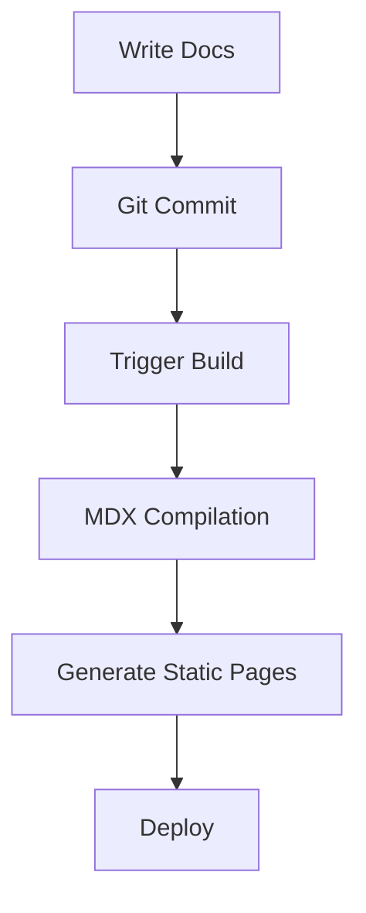
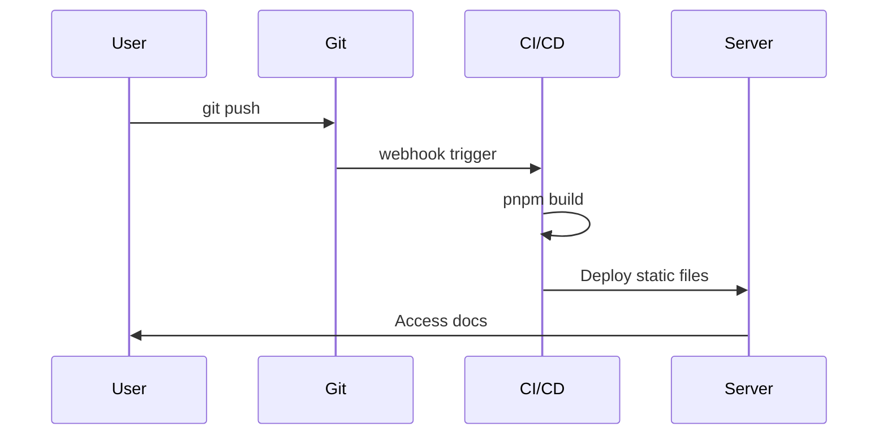

ezdoc provides two categories of MDX components: **Basic components** (Callout, Tabs, Code Blocks, Math Formulas, Mermaid) and **Extended components** (Steps, Card, Accordion, FileTree, Badge, Video, ImageZoom, Tooltip).

For detailed usage and complete examples of extended components, see [Extended Components](/docs/en/guide/extended-components).

## Callout

Use the `Callout` component to highlight important information:

<Callout type="info" title="Info">
  This is an informational note.
</Callout>

<Callout type="warning" title="Warning">
  Make sure your Node.js version is >= 20.
</Callout>

<Callout type="error" title="Danger">
  This operation is irreversible. Proceed with caution.
</Callout>

<Callout type="tip" title="Tip">
  Using `pnpm` gives you faster installation speeds.
</Callout>

## Tabs

Use `Tabs` and `TabItem` to present multiple options:

<Tabs defaultValue="pnpm">
  <TabItem label="pnpm" value="pnpm">
    ```bash
    pnpm install
    ```
  </TabItem>
  <TabItem label="npm" value="npm">
    ```bash
    npm install
    ```
  </TabItem>
  <TabItem label="yarn" value="yarn">
    ```bash
    yarn
    ```
  </TabItem>
</Tabs>

## Code Blocks

### Syntax Highlighting

ezdoc uses Shiki for syntax highlighting with support for many languages:

```typescript
interface User {
  id: number;
  name: string;
  email: string;
}

function greet(user: User): string {
  return `Hello, ${user.name}!`;
}
```

```python
def fibonacci(n: int) -> list[int]:
    """Generate Fibonacci sequence."""
    fib = [0, 1]
    for i in range(2, n):
        fib.append(fib[i-1] + fib[i-2])
    return fib[:n]
```

## Math Formulas

ezdoc supports LaTeX math formulas.

Inline formula: The mass-energy equivalence $E = mc^2$ is one of the most famous formulas in physics.

Block formulas:

$$
\int_{-\infty}^{\infty} e^{-x^2} dx = \sqrt{\pi}
$$

$$
\sum_{n=1}^{\infty} \frac{1}{n^2} = \frac{\pi^2}{6}
$$

## Mermaid Diagrams

ezdoc supports Mermaid diagram rendering:





## Extended Components at a Glance

For complete usage of the following components, see [Extended Components Guide](/docs/en/guide/extended-components).

### Steps

<Steps>
  <Step title="Install">Install project dependencies.</Step>
  <Step title="Configure">Edit the configuration file.</Step>
  <Step title="Deploy">Build and publish.</Step>
</Steps>

### Card

<CardGroup cols={2}>
  <Card title="Quick Start" icon="🚀">
    Get started with ezdoc in 5 minutes.
  </Card>
  <Card title="Configuration Guide" icon="⚙️">
    Complete configuration reference.
  </Card>
</CardGroup>

### Accordion

<Accordion>
  <AccordionItem title="What syntax is supported?">
    Full support for GFM, KaTeX math formulas, and Mermaid diagrams.
  </AccordionItem>
  <AccordionItem title="How do I add a new page?">
    Create an `.mdx` file and register its path in `docs.json`.
  </AccordionItem>
</Accordion>

### Badge

<Badge>Default</Badge> <Badge variant="success">Stable</Badge> <Badge variant="warning">Experimental</Badge> <Badge variant="error">Deprecated</Badge>

### Tooltip

Hover over <Tooltip content="Model Context Protocol">MCP</Tooltip> or <Tooltip content="Markdown + JSX hybrid format">MDX</Tooltip> to see the tooltip.
