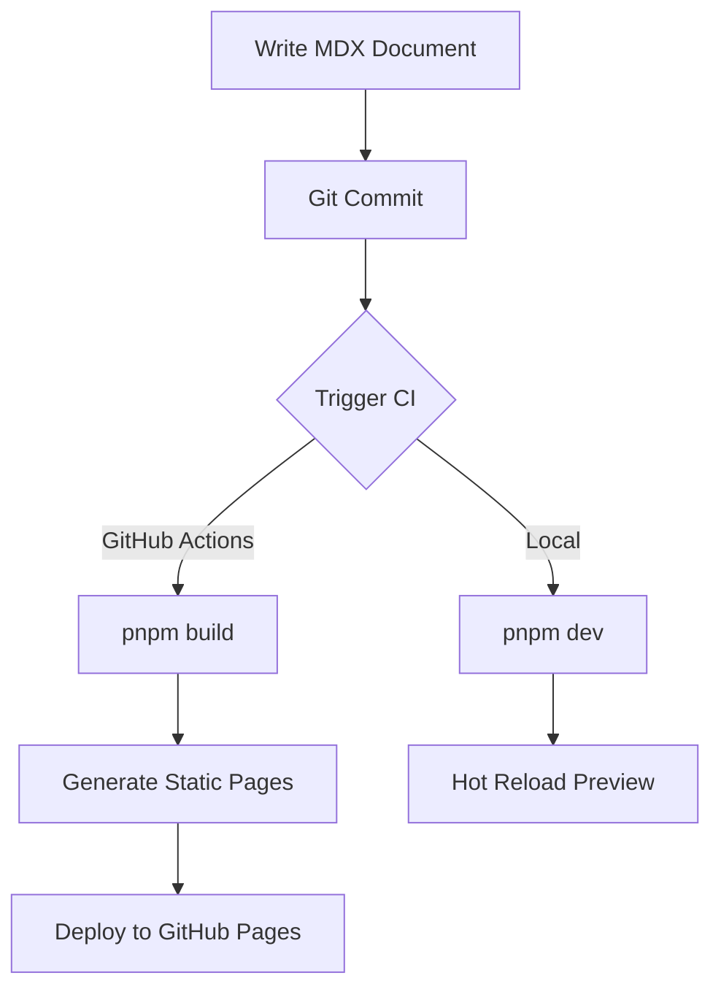
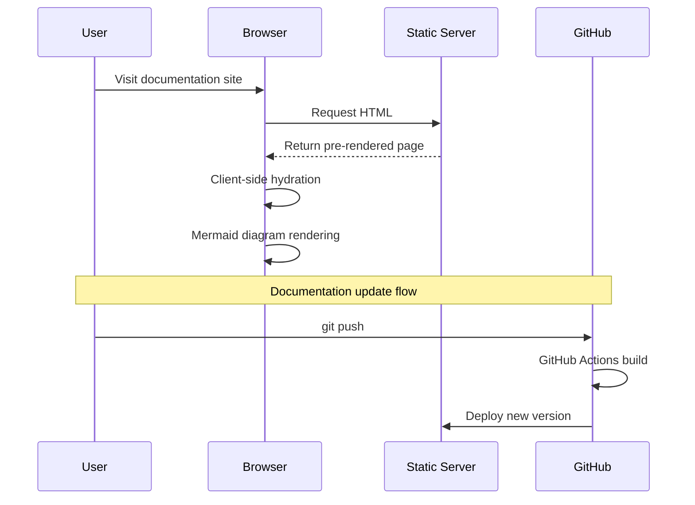
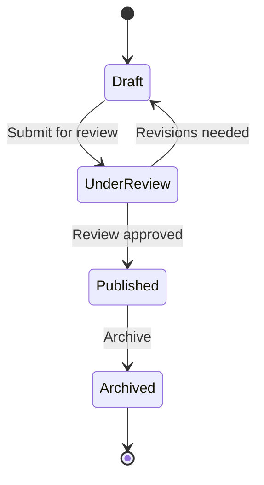
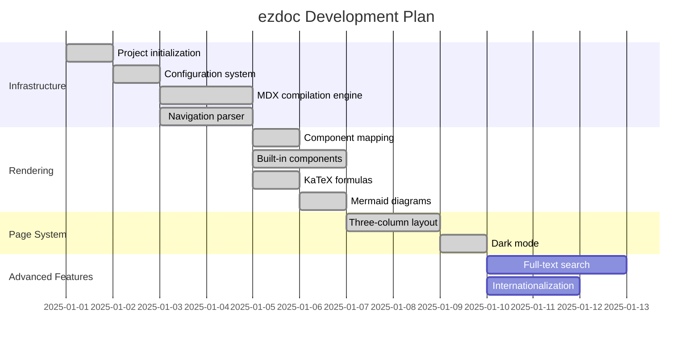
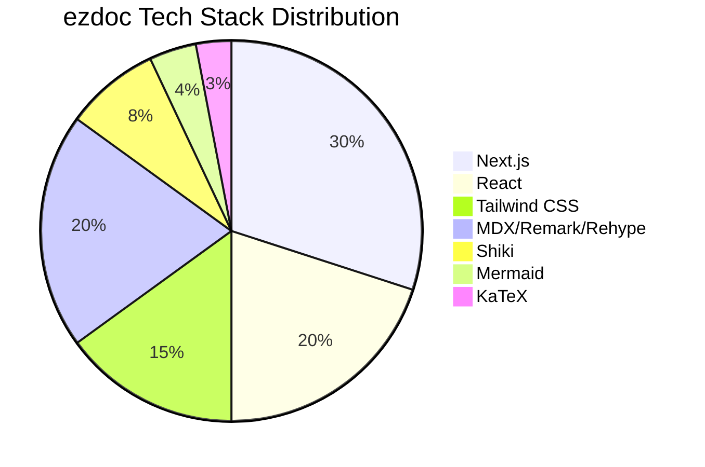
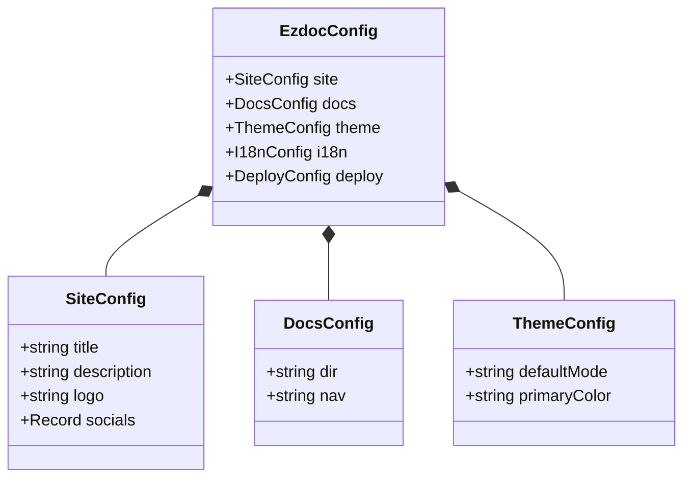

## Math Formulas

ezdoc uses KaTeX to compile math formulas at build time, requiring no client-side JavaScript for extremely fast rendering.

### Inline Formulas

Use `$...$` to insert inline formulas within text:

- The mass-energy equation $E = mc^2$ reveals the equivalence of mass and energy
- Euler's identity $e^{i\pi} + 1 = 0$ is regarded as the most elegant formula in mathematics
- The quadratic formula $x = \frac{-b \pm \sqrt{b^2 - 4ac}}{2a}$
- The Pythagorean theorem $a^2 + b^2 = c^2$

### Block Formulas

Use `$$...$$` to create centered block-level formulas:

**Gaussian Integral**

$$
\int_{-\infty}^{\infty} e^{-x^2} \, dx = \sqrt{\pi}
$$

**Euler's Formula**

$$
e^{ix} = \cos x + i \sin x
$$

**Basel Problem**

$$
\sum_{n=1}^{\infty} \frac{1}{n^2} = \frac{\pi^2}{6}
$$

**Maxwell's Equations**

$$
\begin{aligned}
\nabla \cdot \mathbf{E} &= \frac{\rho}{\varepsilon_0} \\
\nabla \cdot \mathbf{B} &= 0 \\
\nabla \times \mathbf{E} &= -\frac{\partial \mathbf{B}}{\partial t} \\
\nabla \times \mathbf{B} &= \mu_0 \mathbf{J} + \mu_0 \varepsilon_0 \frac{\partial \mathbf{E}}{\partial t}
\end{aligned}
$$

**Matrix Operations**

$$
\mathbf{A} = \begin{pmatrix}
a_{11} & a_{12} & a_{13} \\
a_{21} & a_{22} & a_{23} \\
a_{31} & a_{32} & a_{33}
\end{pmatrix}, \quad
\det(\mathbf{A}) = \sum_{\sigma \in S_3} \text{sgn}(\sigma) \prod_{i=1}^{3} a_{i,\sigma(i)}
$$

**Bayes' Theorem**

$$
P(A \mid B) = \frac{P(B \mid A) \, P(A)}{P(B)}
$$

---

## Mermaid Diagrams

ezdoc supports client-side rendering of Mermaid diagrams, with color schemes that automatically adapt to light and dark themes.

### Flowchart

### Sequence Diagram

### State Diagram

### Gantt Chart

### Pie Chart

### Class Diagram

